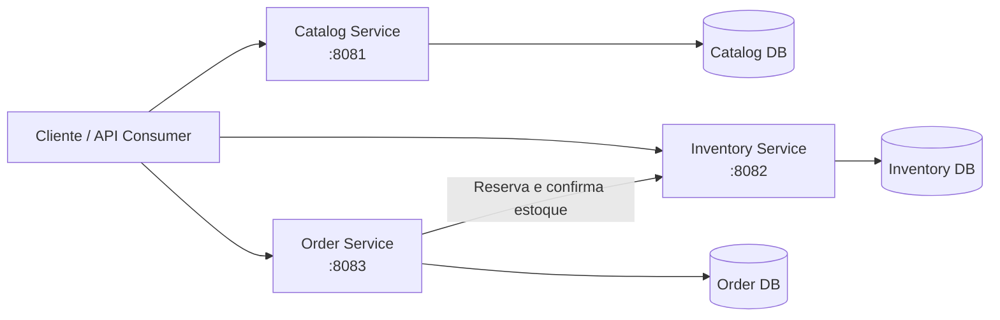

# Enterprise Order Platform

[](https://openjdk.org/projects/jdk/21/)
[](https://spring.io/projects/spring-boot)
[](https://maven.apache.org/)
[](https://www.postgresql.org/)
[](LICENSE)

Plataforma de e-commerce baseada em microsserviços, construída para demonstrar práticas modernas de arquitetura, engenharia de software, qualidade e documentação em um ambiente corporativo simulado.

## Executive Summary

O Enterprise Order Platform representa a evolução incremental da plataforma Mercado Aurora. O projeto aplica Java 21, Spring Boot, PostgreSQL e APIs REST a domínios independentes de catálogo, estoque e pedidos.

Como portfólio técnico, evidencia decisões e entregas rastreáveis: DDD, arquitetura hexagonal, testes automatizados, ADRs, GitHub Flow, quality gates, releases e papéis especializados de engenharia. Esta página oferece a visão executiva; os detalhes permanecem nas documentações de arquitetura, domínio, API e qualidade.

## Navegação

- [Arquitetura](#arquitetura)
- [Microsserviços](#microsserviços)
- [Principais capacidades](#principais-capacidades)
- [Como executar](#como-executar)
- [Fluxo funcional](#fluxo-funcional)
- [Qualidade](#qualidade)
- [Documentação](#documentação)
- [Roadmap](#roadmap)
- [Releases](#releases)
- [Contribuição](#contribuição)

## Arquitetura

Cada serviço possui domínio, casos de uso e persistência próprios. Na baseline atual, o Order Service orquestra reservas de estoque por REST síncrono e publica assincronamente `OrderConfirmed` v1 quando executado com o perfil Kafka; o consumo permanece pendente da Story #33.



A visão completa está no [Architecture Overview](docs/architecture/ARCHITECTURE.md), no [Context Map](docs/architecture/CONTEXT_MAP.md) e nos [Service Boundaries](docs/architecture/SERVICE_BOUNDARIES.md).

## Microsserviços

| Serviço | Responsabilidade | Porta | Status |
| --- | --- | ---: | :---: |
| [Catalog](services/catalog-service/README.md) | Produtos, SKUs e ciclo de vida do catálogo | 8081 | ✅ Concluído |
| [Inventory](services/inventory-service/README.md) | Estoque físico e ciclo de vida das reservas | 8082 | ✅ Concluído |
| [Order](services/order-service/README.md) | Pedidos e orquestração de estoque e pagamento simulado | 8083 | ✅ Concluído |

## Principais capacidades

- Domain-Driven Design com aggregates e invariantes encapsuladas.
- Arquitetura hexagonal com separação entre domínio, aplicação, API e infraestrutura.
- Microsserviços com banco de dados por serviço e migrations Flyway.
- APIs REST versionadas e documentadas com OpenAPI/Swagger UI.
- Princípios SOLID e portas/adaptadores para integrações substituíveis.
- Testes de domínio, unidade, integração com Testcontainers e validação funcional via Postman.
- GitHub Flow baseado em issues, branches, pull requests, quality gates e releases.
- ADRs, histórico do projeto, playbooks de papéis e documentação corporativa versionada.

## Como executar

### Pré-requisitos

- Java 21 LTS.
- Maven 3.9 ou superior.
- Docker Engine, recomendado para executar o PostgreSQL 16.

Valide o ambiente:

```bash
java -version
mvn -version
docker --version
```

### PostgreSQL

O guia [Docker — Setup local](docker/README.md) contém os comandos para criar o container, os bancos `catalog`, `inventory` e `order` e seus respectivos usuários.

### Execução dos serviços

Depois de preparar os bancos, inicie cada serviço em um terminal, nesta ordem:

```bash
cd services/catalog-service
mvn spring-boot:run
```

```bash
cd services/inventory-service
mvn spring-boot:run
```

```bash
cd services/order-service
mvn spring-boot:run
```

Fluxo recomendado de inicialização:

```text
PostgreSQL → Catalog → Inventory → Order
```

As interfaces Swagger ficam disponíveis em:

- Catalog: `http://localhost:8081/swagger-ui/index.html`
- Inventory: `http://localhost:8082/swagger-ui/index.html`
- Order: `http://localhost:8083/swagger-ui/index.html`

Para executar os testes de um serviço:

```bash
cd services/<nome-do-servico>
mvn test
```

## Fluxo funcional

O fluxo principal atravessa os três contextos sem compartilhar seus modelos internos:

```text
Criar produto e SKU no Catalog
             ↓
Cadastrar saldo no Inventory
             ↓
Criar pedido no Order
             ↓
Reservar estoque
             ↓
Iniciar e aprovar o pagamento simulado
             ↓
Confirmar pedido e reserva
```

As collections em [`docs/api/postman`](docs/api/postman) oferecem exemplos executáveis. O fluxo de negócio completo está documentado em [Business Flow](docs/business/BUSINESS_FLOW.md).

## Qualidade

A estratégia combina verificações em diferentes níveis:

- testes de domínio e de casos de uso;
- testes de integração com Spring Boot, Testcontainers e PostgreSQL;
- collections Postman por serviço;
- smoke tests, cenários negativos e regressão;
- revisão técnica e validação funcional independente pelo Quality Engineer.

Na validação da Story-009, o quality gate registrou 34 requests, 109 assertions e nenhuma falha. Para evitar divergência futura, a fonte oficial dos resultados é o [relatório de testes da Story-009](docs/quality/story-009/TEST_REPORT.md), acompanhado das [evidências](docs/quality/story-009/EVIDENCE.md) e do [plano de testes](docs/quality/story-009/TEST_PLAN.md).

## Documentação

| Área | Referências |
| --- | --- |
| Arquitetura | [Overview](docs/architecture/ARCHITECTURE.md) · [Context Map](docs/architecture/CONTEXT_MAP.md) · [Service Boundaries](docs/architecture/SERVICE_BOUNDARIES.md) · [C4](docs/architecture/C4.md) |
| Decisões | [Architecture Decision Records](docs/architecture/ADR/README.md) · [Architecture Notes](docs/architecture/ARCHITECTURE_NOTES.md) |
| Domínio | [Business Discovery](docs/business/BUSINESS_DISCOVERY.md) · [Business Flow](docs/business/BUSINESS_FLOW.md) · [Glossário](docs/business/GLOSSARY.md) |
| APIs | [Collections Postman](docs/api/postman/README.md) · READMEs de [Catalog](services/catalog-service/README.md), [Inventory](services/inventory-service/README.md) e [Order](services/order-service/README.md) |
| Qualidade | [Story-009 Quality Gate](docs/quality/story-009/TEST_REPORT.md) |
| Governança | [Team Charter](docs/team/TEAM_CHARTER.md) · [Workflow](docs/team/WORKFLOW.md) · [Playbooks](docs/team/roles/README.md) |
| Histórico | [Project History](docs/team/PROJECT_HISTORY.md) · [Changelog](CHANGELOG.md) · [Release notes](docs/releases) |

## Governança

O [Engineering Workflow](docs/team/ENGINEERING_WORKFLOW.md) é a fonte institucional de verdade para governança, handoffs, authority matrix, gates de arquitetura e qualidade, pull requests, releases e encerramento de Sprint. Os playbooks de cada papel são especializações desse fluxo.

A direção evolutiva da plataforma está registrada no [Engineering Roadmap](docs/team/ENGINEERING_ROADMAP.md). O roadmap é revisado a cada encerramento de Sprint e não substitui planejamento aprovado, backlog ou decisões arquiteturais.

## Roadmap

| Estado | Evolução |
| :---: | --- |
| ✅ | Catalog Service |
| ✅ | Inventory Service |
| ✅ | Order Service e PaymentFakeAdapter |
| 🗓️ | Payment, Fulfillment e Notification Services |
| 🗓️ | Sprint 2: evolução incremental para eventos com Kafka (`OrderConfirmed` v1); REST permanece suportado |
| 🗓️ | Saga Pattern, após validação do primeiro fluxo assíncrono |
| 🗓️ | Resiliência, observabilidade e rastreamento distribuído |
| 🗓️ | Autenticação, autorização e API Gateway |
| 🗓️ | Ambiente completo com Docker Compose |
| 🗓️ | CI/CD e implantação em Kubernetes |

Consulte o [roadmap detalhado](docs/roadmap/Roadmap_Estudos_Portfolio_Java_TechLead_v2.md) para o plano de evolução.

O planejamento aprovado da Sprint 2 e as convenções institucionais estão no [Sprint 2 Product Plan](docs/team/sprints/SPRINT_2_PRODUCT_PLAN.md) e no [Event Catalog](docs/architecture/events/EVENT_CATALOG.md). A infraestrutura Kafka local está operacional e o primeiro producer, `OrderConfirmed` v1, está implementado no Order Service.

## Releases

- [`v0.3.0-order-service`](docs/releases/v0.3.0-order-service.md) — Order Service e conclusão da Story-009.
- [`v0.2.0-inventory-service`](https://github.com/mhjmhj2002/enterprise-order-platform/releases/tag/v0.2.0-inventory-service) — Inventory Service.
- [Todas as releases publicadas](https://github.com/mhjmhj2002/enterprise-order-platform/releases).

## Contribuição

O projeto utiliza issues para escopo e rastreabilidade, branches por Story, pull requests para revisão e quality gates antes do merge. Antes de propor uma mudança:

1. consulte o [workflow do time](docs/team/WORKFLOW.md);
2. associe a mudança a uma issue;
3. mantenha código, testes e documentação sincronizados;
4. registre decisões arquiteturais relevantes em ADR;
5. submeta a alteração por pull request.

## Licença

Distribuído sob a [licença MIT](LICENSE).
