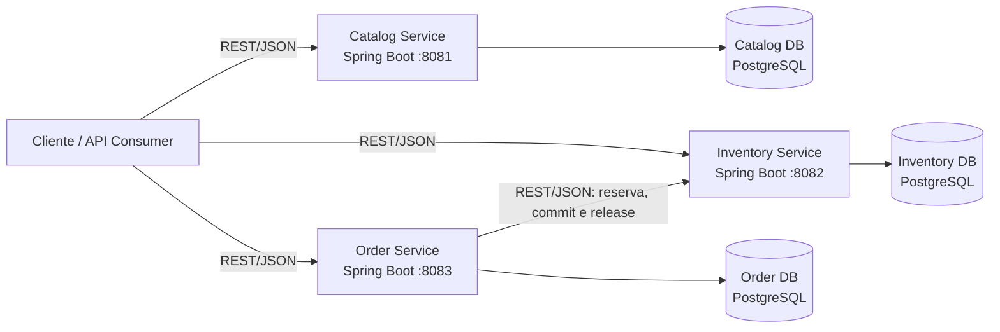
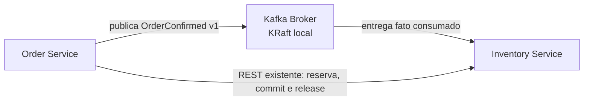

# C4 Model — Sprint 1 baseline, Sprint 2 events e Sprint 3 reliability

## Escopo

Visão resumida dos containers implementados na Sprint 1. Os detalhes de componentes permanecem nos READMEs dos serviços e nas ADRs, evitando duplicação.

## Container Diagram

## Limites da baseline REST

- Catalog, Inventory e Order são os únicos microsserviços implementados.
- Cada serviço possui banco de dados próprio.
- Order integra-se somente com Inventory por REST síncrono.
- Pagamento é simulado internamente por `PaymentFakeAdapter`; não existe Payment Service.
- A mensageria é um acréscimo incremental posterior; API Gateway não está no escopo.

## Evolução implementada — Sprint 2 e Sprint 3

O diagrama mostra o único acréscimo assíncrono implementado. A recuperação de pendências é um componente interno do Inventory, não um novo container nem um novo serviço.

- Kafka foi introduzido incrementalmente; REST permanece suportado.
- `OrderConfirmed` v1 é o único evento institucionalizado.
- O Inventory registra uma pendência durável e a recupera localmente para falhas temporárias, preservando um único efeito por `eventId`; não repete reserva nem cria regra de estoque.
- Payment Service, Saga, Gateway e migração integral de REST permanecem fora de escopo.

## Referências

- [Architecture Overview](ARCHITECTURE.md)
- [Context Map](CONTEXT_MAP.md)
- [Service Boundaries](SERVICE_BOUNDARIES.md)
- [Event Catalog](events/EVENT_CATALOG.md)
- [ADRs](ADR/README.md)
