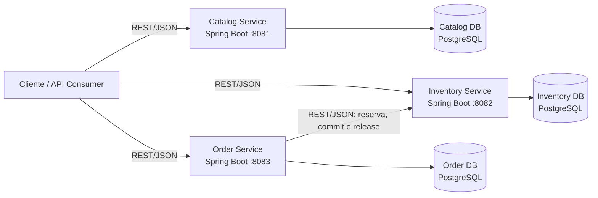
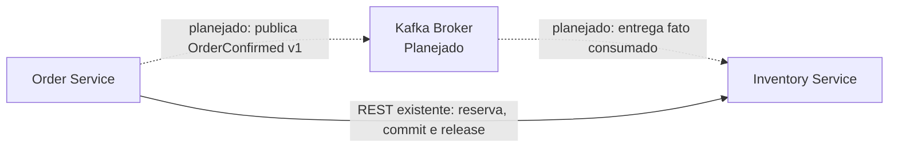

# C4 Model — Sprint 1 Baseline e Sprint 2 Planejada

## Escopo

Visão resumida dos containers implementados na Sprint 1. Os detalhes de componentes permanecem nos READMEs dos serviços e nas ADRs, evitando duplicação.

## Container Diagram

## Limites da baseline

- Catalog, Inventory e Order são os únicos microsserviços implementados.
- Cada serviço possui banco de dados próprio.
- Order integra-se somente com Inventory por REST síncrono.
- Pagamento é simulado internamente por `PaymentFakeAdapter`; não existe Payment Service.
- Não há mensageria, API Gateway ou publicação de Domain Events.

## Evolução planejada — Sprint 2

O diagrama abaixo registra o único acréscimo arquitetural aprovado para planejamento. Os elementos tracejados são planejados: não representam containers implementados nem autorizam início de código.

- Kafka será introduzido incrementalmente; REST permanece suportado.
- `OrderConfirmed` v1 é o único evento institucionalizado nesta baseline de planejamento.
- O comportamento verificável do Inventory será refinado antes da implementação e não poderá repetir reserva ou criar nova regra de estoque.
- Payment Service, Saga, Gateway e migração integral de REST permanecem fora de escopo.

## Referências

- [Architecture Overview](ARCHITECTURE.md)
- [Context Map](CONTEXT_MAP.md)
- [Service Boundaries](SERVICE_BOUNDARIES.md)
- [Event Catalog](events/EVENT_CATALOG.md)
- [ADRs](ADR/README.md)
