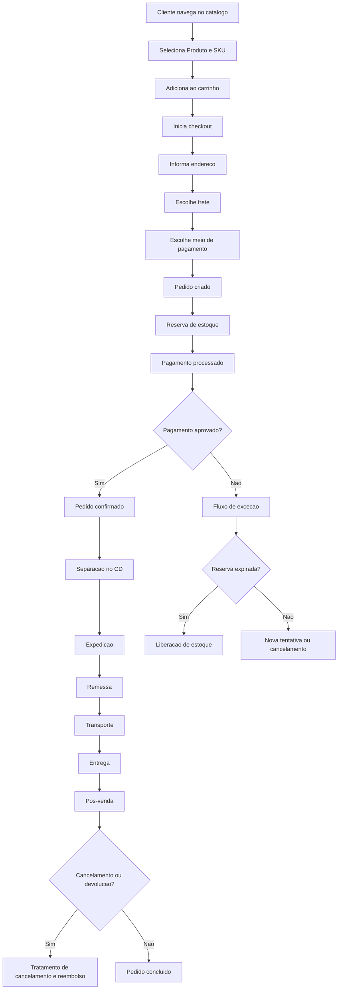

# Business Flow - Mercado Aurora

## Objetivo

Descrever, em linguagem de negocio, a jornada completa de um pedido no Mercado Aurora, do interesse de compra ate o pos-venda.

## Escopo

Este documento cobre o fluxo de ponta a ponta de compra, incluindo etapas principais, variacoes operacionais e situacoes de excecao que impactam cliente, operacao e atendimento.

## Fluxo Principal

1. O cliente navega pelo catalogo e compara opcoes.
2. O cliente seleciona Produto e SKU desejados.
3. O item e adicionado ao carrinho.
4. O cliente inicia o checkout.
5. O cliente informa endereco de entrega.
6. O cliente escolhe opcao de frete.
7. O cliente escolhe o meio de pagamento.
8. O pedido e criado com os itens e condicoes comerciais.
9. A reserva de estoque e realizada para os itens do pedido.
10. O pagamento e processado.
11. Com pagamento aprovado, o pedido e confirmado.
12. O Operador de CD inicia separacao dos itens.
13. A expedicao prepara os volumes para saida.
14. Uma ou mais remessas sao geradas.
15. A transportadora realiza o transporte.
16. O pedido e entregue ao cliente.
17. O pos-venda acompanha solicitacoes de atendimento.
18. Quando aplicavel, fluxos de cancelamento e reembolso sao executados.

## Fluxos Alternativos

### Pagamento recusado

O pedido nao e confirmado. A reserva de estoque deve ser liberada conforme regra vigente e o cliente recebe orientacao para nova tentativa com outro meio de pagamento.

### Timeout de pagamento

Quando nao ha retorno conclusivo no tempo esperado, o pedido entra em tratamento de excecao para conciliacao. O objetivo e evitar dupla cobranca e manter o cliente informado sobre o status real.

### Reserva de estoque expirada

Se a compra nao e concluida dentro da janela de reserva, os itens retornam ao estoque disponivel e o carrinho pode precisar de nova validacao.

### Item sem estoque

Se nao houver disponibilidade no momento da confirmacao, o item nao segue no fluxo de compra e o cliente recebe alternativa de ajuste do pedido.

### Entrega parcial

Quando os itens precisam sair de CDs diferentes ou tem prazos distintos, o pedido e dividido em remessas. O cliente acompanha cada remessa de forma independente.

### Devolucao

Apos entrega, o cliente pode solicitar devolucao conforme politica comercial. O atendimento registra o chamado, acompanha retorno logistico e aciona o fluxo financeiro correspondente.

### Cancelamento antes da expedicao

Quando a operacao ainda nao despachou a remessa, o cancelamento tende a ser mais simples, com liberacao de estoque e tratamento financeiro conforme o estado do pagamento.

### Cancelamento apos expedicao

Quando a remessa ja saiu para transporte, o cancelamento depende do estagio logistico. Pode haver tentativa de interceptacao, recusa no recebimento ou devolucao posterior.

## Atores envolvidos

- Cliente
- Atendimento
- Financeiro
- Logistica
- Operador de CD
- Transportadora
- ERP

## Pontos de decisao do negocio

- O estoque disponivel atende ao pedido?
- O pagamento foi aprovado?
- O pedido ainda pode ser cancelado no estagio atual?
- E necessario dividir em entrega parcial?
- A devolucao atende as regras comerciais vigentes?

## Regras de negocio observadas

- SKU e a unidade transacionavel de compra.
- Reserva de estoque ocorre no checkout para evitar venda simultanea.
- Confirmacao do pedido depende de conclusao de pagamento.
- Um pedido pode gerar multiplas remessas.
- Entrega e compromisso de negocio com prazo prometido.
- Atendimento precisa de rastreabilidade do ciclo completo para tratar excecoes.

## Questoes em aberto

- Qual politica padrao para expiracao e renovacao de reserva no checkout?
- Qual o tempo limite oficial para tratar timeout de pagamento sem degradar experiencia do cliente?
- Qual regra operacional para cancelamento em pedidos com remessas em estagios diferentes?
- Como padronizar devolucao parcial em pedidos com multiplas entregas?

## Oportunidades futuras

- Reduzir abandono no checkout com comunicacao mais clara em excecoes.
- Aumentar previsibilidade para atendimento com timeline unica do pedido.
- Melhorar conversao em cenarios de indisponibilidade temporaria de pagamento.
- Melhorar experiencia de pos-venda com regras transparentes de cancelamento e devolucao.

## Fluxograma (visao de negocio)

