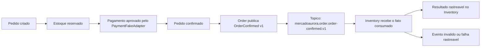

# Sprint 2 — Product Plan: Event-Driven Architecture

**Status:** APPROVED — backlog refinado e sincronizado em 2026-07-13

**Responsavel pela proposta:** Product Owner

**Data:** 2026-07-11

**Baseline de partida:** Sprint 1 encerrada — Catalog, Inventory e Order Services integrados por REST

## 1. Sprint Goal

Introduzir a primeira comunicacao assincrona orientada a eventos entre Order e
Inventory, mantendo os fluxos REST existentes, para demonstrar de ponta a ponta
que a confirmacao de um pedido pode gerar um fato de negocio rastreavel e ser
processada de forma assincrona por outro servico. A Sprint sera bem-sucedida
quando esse fluxo estiver disponivel em ambiente local reproduzivel, documentado
e com evidencias verificaveis de publicacao, consumo e tratamento rastreavel de
falhas.

## 2. Contexto, problema e valor esperado

Na baseline atual, o Order Service coordena com o Inventory Service por chamadas
REST sincronas. Esse fluxo atende ao caso atual, mas torna a continuidade da
operacao dependente da disponibilidade imediata entre os dois servicos e nao
oferece uma experiencia pratica de processamento assincrono para fatos que
ocorrem apos a confirmacao do pedido.

A oportunidade desta Sprint e introduzir uma capacidade incremental de eventos,
sem substituir o REST onde ele continua necessario. O fato de negocio inicial
proposto e **pedido confirmado**: apos a confirmacao comercial do pedido, outros
servicos podem tomar conhecimento desse fato sem uma nova chamada sincronica do
Order Service.

O valor esperado e reduzir o acoplamento temporal para esse fluxo posterior,
criar uma baseline de aprendizado validavel de arquitetura orientada a eventos e
ampliar a rastreabilidade operacional do ciclo de confirmacao. A consistencia
entre servicos passara a admitir processamento eventual neste recorte; isso e um
trade-off consciente, nao uma promessa de processamento exatamente uma vez.

### Premissas de produto

- A confirmacao do pedido continua obedecendo as regras de negocio ja vigentes.
- REST e eventos coexistem nesta Sprint; nao ha migracao integral do fluxo atual.
- O evento descreve um fato de dominio ocorrido, e nao uma instrucao tecnica.
- O comportamento especifico que o Inventory executara apos receber o evento
  dependera da validacao do Engineering Manager e do refinamento com Engenharia.

## 3. Evento inicial, Event Catalog e convencoes

### Nomenclatura validada do Domain Event

O primeiro evento da Sprint sera **`OrderConfirmed` v1**. A nomenclatura e
aderente ao fluxo de negocio: o pedido somente e confirmado apos a aprovacao do
pagamento; logo, o evento comunica um fato ja ocorrido, e nao um comando, uma
tentativa ou uma etapa tecnica. Nomes como `OrderConfirmationCompleted` ou
`ProcessOrderConfirmation` foram descartados por serem redundantes ou por
descreverem uma acao, e nao o estado de negocio confirmado.

Na baseline efetivamente entregue, esse fato ocorre apos a reserva de estoque e
apos o pagamento ser aprovado pelo `PaymentFakeAdapter` interno. Assim,
`OrderConfirmed` **nao** e gatilho para o Inventory criar uma reserva: quando o
evento existe, a reserva ja foi realizada no fluxo vigente. O consumidor inicial
deve reagir apenas a esse fato consumado com um resultado rastreavel que nao
introduza nova regra de estoque; sua definicao funcional continua sujeita ao
refinamento aprovado pelo EM.

O item fora de escopo e um **Payment Service externo/independente**, nao o
`PaymentFakeAdapter` que ja integra a baseline do Order Service.

### Event Catalog inicial

| Campo | Definicao inicial |
| --- | --- |
| Nome de negocio | Pedido confirmado |
| Domain Event | `OrderConfirmed` |
| Versao | `v1` |
| Producer / owner | Order Service |
| Consumer inicial | Inventory Service |
| Proposito | Comunicar que a confirmacao comercial do pedido foi concluida, permitindo processamento posterior rastreavel sem nova chamada sincrona do Order. |
| Gatilho | Pedido confirmado apos pagamento aprovado, conforme fluxo de negocio vigente. |
| Dados minimos esperados | Identificador do pedido, identificador do evento, data/hora de ocorrencia e identificador de correlacao; outros dados somente mediante necessidade comprovada no refinamento. |
| Resultado esperado no consumidor | Resultado verificavel e rastreavel, a definir no refinamento, sem criar ou repetir reserva de estoque. |

### Convencoes iniciais

Estas convencoes estabelecem o contrato de produto para a Sprint; a Engenharia
define os detalhes de implementacao compativeis com elas.

| Elemento | Convencao | Exemplo inicial |
| --- | --- | --- |
| Nome de evento | PascalCase, no passado, descrevendo fato de dominio imutavel. | `OrderConfirmed` |
| Nome de topico | Minusculas, separadas por ponto: `<organizacao>.<dominio>.<fato-em-kebab-case>.v<versao-maior>`. | `mercadoaurora.order.order-confirmed.v1` |
| Versao de contrato | Sufixo `v` seguido da versao maior. Mudanca compativel permanece na mesma versao; mudanca incompativel cria nova versao e exige plano de coexistencia. | `v1` |
| Ownership | O producer e responsavel pela semantica e evolucao do evento; cada consumer e responsavel por seu proprio resultado de processamento. | Order / Inventory |

### Diagrama funcional simplificado

## 4. Escopo funcional proposto

### Must Have — nucleo minimo recomendado

- Ambiente local reproduzivel para a demonstracao de mensageria e inspecao dos
  eventos.
- Catalogo inicial contendo ao menos o evento `OrderConfirmed` versao 1, seu
  proposito, produtor responsavel (Order), consumidor inicial (Inventory), dados
  minimos de negocio, convencao de nome e expectativa de compatibilidade.
- Publicacao do evento apos uma confirmacao de pedido concluida com sucesso.
- Consumo assincrono pelo Inventory de um evento valido e execucao de um resultado
  verificavel e rastreavel, a ser detalhado sem alterar regras de negocio ja
  aprovadas.
- Protecao contra efeito de negocio duplicado para a repeticao do mesmo evento.
- Registro rastreavel de evento invalido ou nao processavel, com encaminhamento
  definido para analise posterior.
- Evidencia reproduzivel do fluxo ponta a ponta e verificacao de ausencia de
  regressao nos fluxos REST existentes.

### Should Have

- Reprocessamento controlado de falhas recuperaveis, dentro do limite de
  capacidade aprovado pelo Engineering Manager.
- Colecao ou roteiro de validacao que permita demonstrar o fluxo por outra pessoa
  alem de quem o implementou.

### Could Have

- Segundo consumidor somente se o nucleo minimo estiver validado, sem criar nova
  dependencia de negocio ou ampliar os eventos definidos.

### Won't Have nesta Sprint

Os itens da secao "Fora de escopo" nao compoem compromisso desta Sprint.

## 5. Proposta inicial de Stories

As Stories abaixo sao uma proposta de backlog; nao representam issues aprovadas
nem autorizacao para inicio de implementacao.

### Story A — Ambiente local para demonstracao de eventos ([#37 — Story-020](https://github.com/mhjmhj2002/enterprise-order-platform/issues/37))

**Prioridade:** Must Have
**Contexto e descricao:** Disponibilizar um ambiente local reproduzivel que
permita ao time executar e inspecionar a troca de eventos da Sprint.
**Valor esperado:** Viabiliza validacao compartilhada e reduz dependencia de
configuracoes manuais individuais.
**Criterios de aceite:**

- Dado um novo integrante seguindo a orientacao documentada, quando preparar o
  ambiente local, entao ele consegue disponibilizar o ambiente necessario para a
  demonstracao com um procedimento reproduzivel.
- Dado um evento publicado no fluxo da Sprint, quando o ambiente estiver em uso,
  entao existe uma forma documentada de inspecionar sua presenca e seus dados.

**Dependencias:** [#30 — Architecture Gate e Event Platform Technical Contract](https://github.com/mhjmhj2002/enterprise-order-platform/issues/30) e [#31 — Catalogo e contrato do evento](https://github.com/mhjmhj2002/enterprise-order-platform/issues/31).
**Riscos:** Ambiente dificil de reproduzir ou de diagnosticar.
**Fora de escopo da Story:** Ambiente corporativo, alta disponibilidade e
operacao em producao.

### Story B — Catalogo inicial de eventos de pedido ([#31 — Story-015](https://github.com/mhjmhj2002/enterprise-order-platform/issues/31))

**Prioridade:** Must Have
**Contexto e descricao:** Definir o contrato de negocio inicial para comunicar
que um pedido foi confirmado.
**Valor esperado:** Cria linguagem comum, rastreabilidade e limite para a
evolucao sem proliferacao prematura de eventos.
**Criterios de aceite:**

- O catalogo identifica o evento `OrderConfirmed` v1, seu proposito de negocio,
  responsavel pela publicacao, consumidor inicial e convencao de canal.
- O catalogo registra apenas os dados minimos necessarios para identificar a
  confirmacao, correlacionar seu processamento e versionar o contrato.
- Dado que o contrato precise evoluir, quando uma mudanca for proposta, entao a
  documentacao torna explicita como preservar a compatibilidade ou criar nova
  versao.

**Dependencias:** Nenhuma. O catálogo é a base de negócio para o refinamento técnico da [#30](https://github.com/mhjmhj2002/enterprise-order-platform/issues/30).
**Riscos:** Dados em excesso, evento que nao representa fato de dominio ou
contrato definido antes da necessidade.
**Fora de escopo da Story:** Schema Registry e catalogo corporativo de eventos.

### Story C — Publicacao do fato de pedido confirmado ([#32 — Story-016](https://github.com/mhjmhj2002/enterprise-order-platform/issues/32))

**Prioridade:** Must Have
**Contexto e descricao:** Fazer o Order disponibilizar o fato de negocio de que
um pedido foi confirmado.
**Valor esperado:** Permite que interessados saibam da confirmacao sem uma nova
dependencia sincronica do Order.
**Criterios de aceite:**

- Dado um pedido confirmado com sucesso conforme as regras vigentes, quando a
  confirmacao for concluida apos pagamento aprovado e estoque previamente
  reservado, entao um `OrderConfirmed` v1 correspondente fica
  disponivel para processamento assincrono.
- Dado que a confirmacao nao seja concluida, quando o fluxo terminar, entao nao
  ha evento que indique indevidamente pedido confirmado.
- O evento permite correlacionar sua origem com o pedido confirmado, sem expor
  dados alem do necessario ao proposito definido.

**Dependencias:** [#37 — Plataforma local de eventos](https://github.com/mhjmhj2002/enterprise-order-platform/issues/37) e [#31 — Catálogo e contrato do evento](https://github.com/mhjmhj2002/enterprise-order-platform/issues/31).
**Riscos:** Publicacao divergente do estado de negocio ou quebra de fluxo REST.
**Fora de escopo da Story:** Publicar todos os eventos possiveis do ciclo de
pedido.

### Story D — Processamento assincrono verificavel no Inventory ([#33 — Story-017](https://github.com/mhjmhj2002/enterprise-order-platform/issues/33))

**Prioridade:** Must Have
**Contexto e descricao:** Permitir que o Inventory receba o fato de pedido
confirmado e produza um resultado de negocio/operacao verificavel, definido no
refinamento, sem substituir a reserva REST da baseline.
**Valor esperado:** Demonstra valor real da comunicacao assincrona entre servicos
e sua rastreabilidade.
**Criterios de aceite:**

- Dado um `OrderConfirmed` v1 valido disponivel, quando o Inventory o processar,
  entao o resultado definido para a Sprint e observavel e pode ser relacionado ao
  pedido de origem.
- Dado o reenvio do mesmo evento, quando ele for recebido novamente, entao nao
  ocorre duplicacao do efeito de negocio definido.
- Dado um evento invalido ou impossivel de processar, quando o consumo falhar,
  entao a falha fica rastreavel para analise e nao e silenciosamente descartada.

**Dependencias:** [#32 — Publicação de `OrderConfirmed` v1 pelo Order Service](https://github.com/mhjmhj2002/enterprise-order-platform/issues/32).
**Riscos:** Duplicidade, consistencia eventual mal compreendida e acoplamento a
detalhes do produtor.
**Fora de escopo da Story:** Nova regra de reserva, baixa de estoque, Saga ou
compensacao distribuida.

### Story E — Confiabilidade inicial do processamento ([#34 — Story-018](https://github.com/mhjmhj2002/enterprise-order-platform/issues/34))

**Prioridade:** Should Have
**Contexto e descricao:** Estabelecer o comportamento minimo para falhas
recuperaveis e eventos nao processaveis, conforme capacidade aprovada.
**Valor esperado:** Evita que erros operacionais eliminem silenciosamente fatos
de negocio e torna os limites da baseline explicitos.
**Criterios de aceite:**

- Dada uma falha transitoria de processamento, quando houver nova tentativa
  aprovada, entao seu resultado pode ser rastreado.
- Dado um evento que esgote o tratamento definido, quando nao puder ser
  processado, entao ele fica separado e identificavel para tratamento posterior.
- A documentacao deixa explicito que a Sprint nao promete processamento
  exatamente uma vez.

**Dependencias:** [#33 — Consumo de `OrderConfirmed` v1 pelo Inventory Service](https://github.com/mhjmhj2002/enterprise-order-platform/issues/33).
**Riscos:** Consumir a capacidade da Sprint antes da validacao ponta a ponta.
**Fora de escopo da Story:** Garantias distribuidas de exatamente uma vez e
automacao completa de recuperacao.

### Story F — Evidencias e documentacao do fluxo ([#35 — Story-019](https://github.com/mhjmhj2002/enterprise-order-platform/issues/35))

**Prioridade:** Must Have
**Contexto e descricao:** Registrar como validar o fluxo, seu contrato e seus
limites para que o resultado seja auditavel e reutilizavel pelo time.
**Valor esperado:** Mantem documentacao alinhada ao comportamento entregue e
permite aprendizado replicavel.
**Criterios de aceite:**

- A documentacao do fluxo identifica gatilho, evento, produtor, consumidor,
  resultado verificavel e limites conhecidos.
- Existe evidencia de uma execucao ponta a ponta, incluindo publicacao, consumo
  e correlacao com o pedido.
- A validacao cobre o fluxo assincrono proposto e confirma que os fluxos REST
  existentes relevantes nao regrediram.

**Dependencias:** [#34 — Confiabilidade inicial do processamento](https://github.com/mhjmhj2002/enterprise-order-platform/issues/34).
**Riscos:** Evidencia insuficiente ou documentacao divergente da entrega.
**Fora de escopo da Story:** Redesenho completo da documentacao arquitetural;
atualizacoes necessarias serao definidas pelo responsavel tecnico.

## 6. Backlog refinado e rastreabilidade

O backlog foi materializado sem alterar o escopo funcional aprovado. A numeração
das issues segue a sequência institucional de Stories, enquanto as letras desta
proposta preservam a decomposição original de produto.

| Item de planejamento | Issue oficial | Dependência direta no backlog |
| --- | --- | --- |
| Refinamento técnico / Architecture Gate | [#30 — Story-014](https://github.com/mhjmhj2002/enterprise-order-platform/issues/30) | Catálogo da #31 e refinamento EM/Engenharia |
| Story B — Catálogo | [#31 — Story-015](https://github.com/mhjmhj2002/enterprise-order-platform/issues/31) | Nenhuma |
| Story C — Publicação | [#32 — Story-016](https://github.com/mhjmhj2002/enterprise-order-platform/issues/32) | #37 e #31 |
| Story D — Consumo | [#33 — Story-017](https://github.com/mhjmhj2002/enterprise-order-platform/issues/33) | #32 |
| Story E — Confiabilidade | [#34 — Story-018](https://github.com/mhjmhj2002/enterprise-order-platform/issues/34) | #33 |
| Story F — Evidências | [#35 — Story-019](https://github.com/mhjmhj2002/enterprise-order-platform/issues/35) | #34 |
| Story A — Plataforma local | [#37 — Story-020](https://github.com/mhjmhj2002/enterprise-order-platform/issues/37) | #30 e #31 |

O [Event Catalog](../../architecture/events/EVENT_CATALOG.md) permanece a fonte
funcional de `OrderConfirmed` v1. O [Event Platform Technical Contract](../../architecture/contracts/EVENT_PLATFORM_TECHNICAL_CONTRACT.md)
foi aprovado no refinamento #30 e é consistente com este plano; suas decisões
arquiteturais não são alteradas por esta sincronização.

## 7. Fora de escopo da Sprint

- Payment Service externo/independente (o `PaymentFakeAdapter` atual permanece
  como parte da baseline).
- Saga distribuida completa e compensacoes distribuidas.
- API Gateway.
- Autenticacao e autorizacao.
- Service discovery.
- Kubernetes e ambiente de producao.
- Migracao integral das integracoes REST existentes.
- Schema Registry, salvo aprovacao expressa posterior do EM.
- Observabilidade corporativa completa.
- Promessa funcional de processamento exatamente uma vez.
- Novos dominios ou regras de negocio para reserva, baixa ou liberacao de estoque.

## 8. Riscos e mitigacoes de planejamento

| Risco | Impacto de produto | Mitigacao proposta |
| --- | --- | --- |
| Escopo exceder uma Sprint | Entrega sem fluxo ponta a ponta validado | Proteger as Stories A-D e F como nucleo; Story E so apos validar o nucleo. |
| Muitos eventos definidos antecipadamente | Contratos sem valor e maior acoplamento | Limitar o catalogo inicial a `OrderConfirmed` v1. |
| Evento nao representar fato de dominio | Consumidores tomam decisoes sobre sinal inadequado | Validar semantica e ownership no refinamento EM/Engenharia. |
| Duplicidade de processamento | Efeito de negocio repetido | Exigir que o mesmo evento nao gere efeito duplicado. |
| Consistencia eventual surpreender operacao | Interpretacao incorreta do estado entre servicos | Documentar o comportamento, limites e evidencias de correlacao. |
| Infraestrutura local instavel | Time nao consegue validar nem aprender | Exigir procedimento reproduzivel e inspecao simples antes da integracao. |
| Falhas silenciosas | Perda de rastreabilidade | Tornar falhas invalidas ou nao processaveis identificaveis; priorizar tratamento adicional conforme capacidade. |
| Documentacao divergir da entrega | Uso incorreto e perda de aprendizado | Tornar evidencias e atualizacao documental parte do nucleo da Sprint. |

## 9. Dependencias e sequenciamento

1. A #31 sustenta o refinamento técnico #30; a #37 depende de ambos.
2. A #32 depende de #37 e #31; a #33 depende de #32; a #34 depende de #33; e a
   #35 depende de #34.
3. QE e Technical Writer participam da definição de evidências e da validação
   final, conforme o workflow do time.

## 10. Metricas e evidencias de sucesso

- Uma pessoa do time inicia o ambiente local pelo procedimento documentado e
  consegue inspecionar eventos sem configuracao manual adicional.
- Ao menos um fluxo `OrderConfirmed` v1 percorre produtor e consumidor de ponta a
  ponta, com correlacao verificavel ao pedido de origem.
- O catalogo registra evento, ownership, dados minimos, convencao e versao.
- A repeticao do mesmo evento nao gera efeito de negocio duplicado no resultado
  definido.
- Ao menos uma falha de consumo invalida ou nao processavel possui rastreabilidade
  verificavel.
- Evidencias de teste/execucao e documentacao do fluxo estao atualizadas.
- Os fluxos REST existentes relevantes continuam validados sem regressao.

## 11. Pontos para decisao do Engineering Manager

1. Confirmar, com Engenharia, qual resultado funcional minimo e seguro o Inventory
   produzira ao receber o evento, sem introduzir regra de negocio nova.
2. Confirmar que o nucleo Must Have cabe na capacidade da Sprint e se Story E
   permanece Should Have ou deve ser postergada integralmente.
3. Validar a expectativa minima para reprocessamento e separacao de eventos nao
   processaveis, sem prometer exatamente uma vez.
4. Confirmar responsaveis pelas atualizacoes tecnicas de arquitetura e pelas
   evidencias de qualidade, preservando as fronteiras de papel.
5. Reavaliar somente alterações futuras que extrapolem o contrato técnico aprovado.

## 12. Sintese de aprovacao e encaminhamento

> Product Planning da Sprint 2 aprovado com refinamentos incorporados. O compromisso
> minimo recomendado e demonstrar `OrderConfirmed` v1 de ponta a ponta entre
> Order e Inventory, em ambiente local reproduzivel, com catalogo de evento,
> rastreabilidade de consumo/falhas, protecao contra efeito duplicado e sem
> migrar os fluxos REST. As decisoes pendentes concentram-se no resultado
> funcional do consumidor, capacidade para confiabilidade inicial e limites
> tecnicos que cabem na Sprint. O artefato esta pronto para encaminhamento ao
> Technical Writer; nenhuma implementacao e autorizada por este documento.

## 13. Resultado

**APPROVED**
